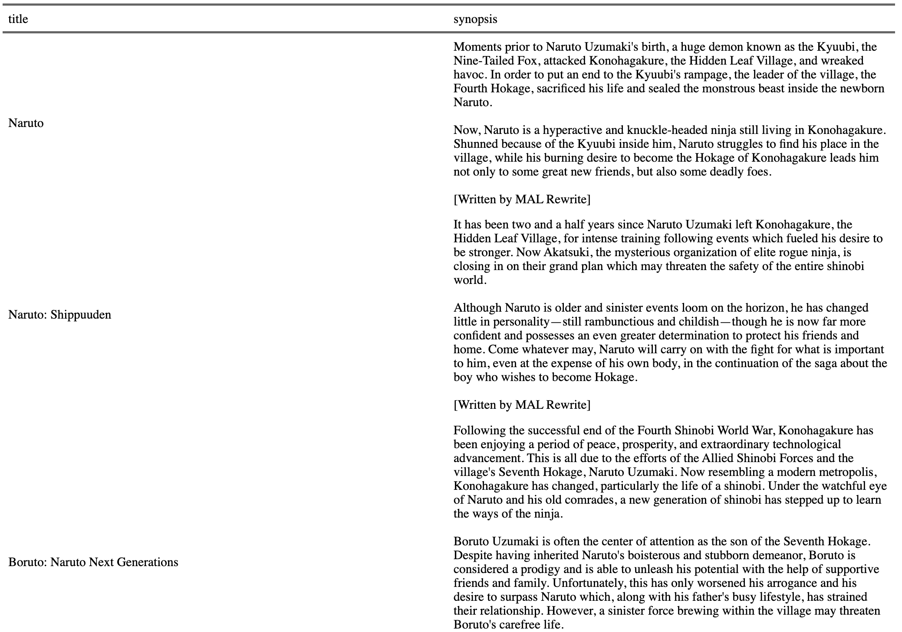
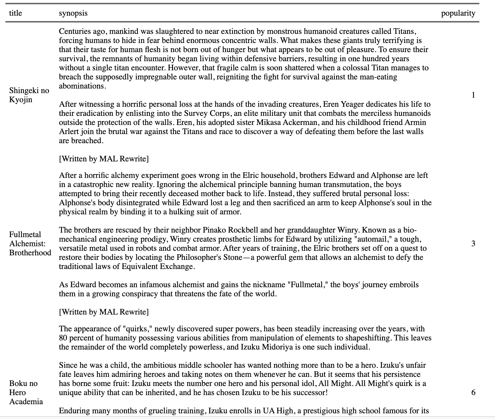
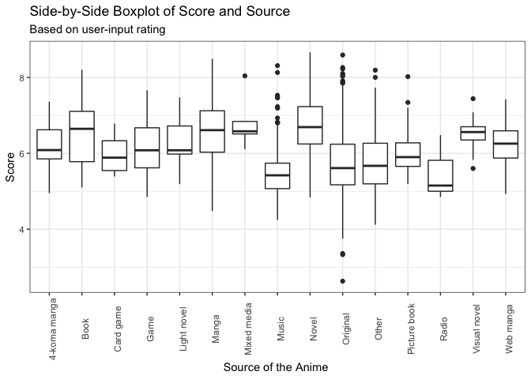

<!-- README.md is generated from README.Rmd. Please edit that file -->

# animeR 

<!-- badges: start -->

[](https://lifecycle.r-lib.org/articles/stages.html#experimental)
[](https://CRAN.R-project.org/package=animeR)
[](https://github.com/Charavee/animeR/actions/workflows/R-CMD-check.yaml)
<!-- badges: end -->

## Purpose

The goal of animeR is to help anime directors and anime lovers to
understand the current trend in the anime industry. The package builds
on the dataset Anime.csv which includes information about over 20,000
different animes, such as their name, time aired, producers, genres,
synopsis, score, popularity, and more. Our goal for this package is to
provide tools for anime lovers and directors to easily filter for their
desired criteria, understand recurring themes, and predict the
popularity of a anime.

## Target Audience

Our target audience would be people interested in anime or newly
exploring anime who may be looking for detailed anime information and/or
recommendations, and creative professionals, such as directors and
people who works in anime or media industry, who want to understand the
trends in their industry.

## Installation

You can install the development version of animeR like so:

``` r
devtools::install_github("cbasnetchettri/animeR")
library(animeR)
```

## List of Functions

animeR package includes seven different functions that help anyone who
is interested in anime and those who is working in anime, TV, and
cultural industry. Below is the list of seven functions with brief
explanations of each function.

1)  `search_anime(title)`: This function serves as a tool to obtain an
    overview of filtering tool for anime lovers to locate the list of
    anime of their interest.

2)  `anime_rec(genre, source, n)`: The function outputs a list of top
    *n* anime of user specified genre and source with their synopsis on
    popularity rating.

3)  `unique_list(variable)`: This function helps you to find all genres
    and sources that you can use as an input for other function, such as
    `anime_rec()`. The list of unique themes, licensors, producers, and
    studios can be checked too.

4)  `get_trend(input_type)`: This function is used to generate
    visualizations to show the trend of anime duration and score
    distributions across different producers and genre.

5)  `rank_popular(n)`: This function returns a list of the *n* anime of
    all time based on popularity, providing information of the anime’s
    genres, ranked, rating and source.

6)  `get_theme(input_type)`: This function is used to generate a word
    cloud that shows the most popular words of in all the anime’s
    synopsis. Users can input the type of anime, such as “Movies” and
    “TV” to narrow down their search.

7)  `score_source_byrating(rating)`: This function returns a
    side-by-side boxplot comparing the scores (out of 10) of different
    sources given the rating specified by the user.

## Examples

``` r
library(animeR)
```

``` r
# Search all the anime that has "Naruto" in their title. Please make sure to have a character as an input.
search_anime("Naruto")
```

# 

``` r
# Search the top 5 Action anime based on manga and obtain their synopsis
anime_rec("Action", "Manga", 5)
```

# 

``` r
#Obtain the top 10 most popular anime and quick information like source, genre, rank etc.
rank_popular(10)
#> # A tibble: 10 × 6
#>    popularity title                            genres       source ranked rating
#>         <dbl> <chr>                            <chr>        <chr>   <dbl> <chr> 
#>  1          1 Shingeki no Kyojin               Action, Dra… Manga    1002 R - 1…
#>  2          2 Death Note                       Supernatura… Manga     732 R - 1…
#>  3          3 Fullmetal Alchemist: Brotherhood Action, Adv… Manga      12 R - 1…
#>  4          4 One Punch Man                    Action, Com… Web m…   1112 R - 1…
#>  5          5 Sword Art Online                 Action, Adv… Light…  29562 PG-13…
#>  6          6 Boku no Hero Academia            Action       Manga    6722 PG-13…
#>  7          7 Naruto                           Action, Adv… Manga    5982 PG-13…
#>  8          8 Tokyo Ghoul                      Action, Fan… Manga    9082 R - 1…
#>  9          9 Kimetsu no Yaiba                 Action, Fan… Manga    1042 R - 1…
#> 10         10 Hunter x Hunter (2011)           Action, Adv… Manga      92 PG-13…
```

``` r
#Obtain a side-by-side boxplot
score_source_byrating("G")
```



For further examples and capabilities, please see the
[vignette](https://github.com/cbasnetchettri/animeR/blob/main/vignettes/animeR.Rmd).

## Contributors

-   Charavee Basnet Chettri
-   Michiru Nozawa
-   Lily Diao
