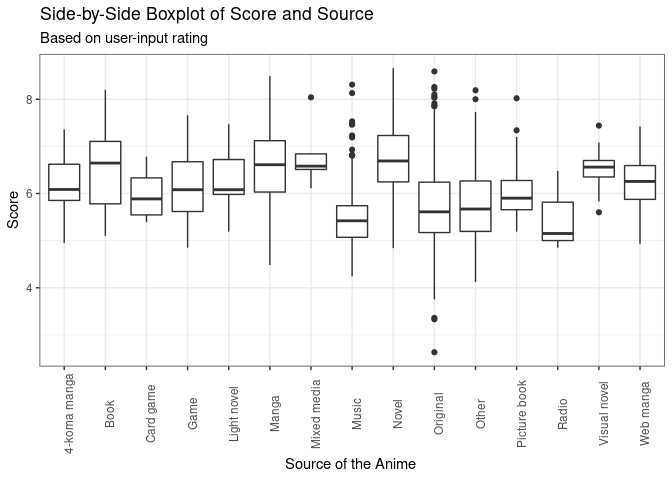

<!-- README.md is generated from README.Rmd. Please edit that file -->

# animeR 

<!-- badges: start -->

[](https://lifecycle.r-lib.org/articles/stages.html#experimental)
[](https://CRAN.R-project.org/package=animeR)
[](https://github.com/Charavee/animeR/actions/workflows/R-CMD-check.yaml)
<!-- badges: end -->

## Purpose

The goal of animeR is to help anime directors and anime lovers to
understand the current trend in the anime industry. The package builds
on the dataset Anime.csv which includes information about over 20,000
different animes, such as their name, time aired, producers, genres,
synopsis, score, popularity, and more. Our goal for this package is to
provide tools for anime lovers and directors to easily filter for their
desired criteria, understand recurring themes, and predict the
popularity of a anime.

## Target Audience

Our target audience would be people interested in anime or newly
exploring anime who may be looking for detailed anime information and/or
recommendations, and creative professionals, such as directors and
people who works in anime or media industry, who want to understand the
trends in their industry.

## Installation

You can install the development version of animeR like so:

``` r
devtools::install_github("cbasnetchettri/animeR")
library(animeR)
```

## List of Functions

We will be creating the followng functions for this project. Two
functions are mainly targeting anime lovers, one helping them to search
information about specific anime and another one helping them to get
anime recommendation according to their preference. The rest of the
functions help anime producers to understand the the general info of the
anime industry, under stand the current trend reflected by the synopsis,
and use a model to predict the popularity of a specific anime.

1)  `search_anime(title)`: This function serves as a tool to obtain an
    overview of filtering tool for anime lovers to locate the list of
    anime of their interest.

2)  `anime_rec(genre, source, n)`: The function outputs a list of top
    *n* anime of user specified genre and source with their synopsis on
    popularity rating.

3)  `unique_list(variable)`: This function helps you to find all genres
    and sources that you can use as an input for other function, such as
    `anime_rec()`. The list of unique themes, licensors, producers, and
    studios can be checked too.

4)  `get_trend()`: This function takes in genre x and year y and output
    a wordcloud that shows the most recurring themes and words in the
    anime’s synopsis.

5)  `rank_popular(n)`: This function returns a list of the *n* anime of
    all time based on popularity, providing information of the anime’s
    genres, ranked, rating and source.

6)  `predict_popularity( )`: this function fits a multiple regression
    model predicting the popularity rating of an anime based on
    categorical variables like the Source of the anime. Also, this
    function conducts model analysis to help anime directors and
    investors to predict the popularity of a potential anime.

7)  `score_source_byrating(rating)`: This function returns a
    side-by-side boxplot comparing the scores (out of 10) of different
    sources given the rating specified by the user.

## Examples

``` r
library(animeR)

# Search all the anime that has "Naruto" in their title. Please make sure to have a character as an input.
search_anime("Naruto")
#> a flextable object.
#> col_keys: `title`, `synopsis` 
#> header has 1 row(s) 
#> body has 27 row(s) 
#> original dataset sample: 
#>                             title
#> 1                          Naruto
#> 2              Naruto: Shippuuden
#> 3 Boruto: Naruto Next Generations
#> 4      The Last: Naruto the Movie
#> 5        Boruto: Naruto the Movie
#>                                                                                                                                                                                                                                                                                                                                                                                                                                                                                                                                                                                                                                                                                                                                                                                                                                                                                                                                                                                                                                                                                                                                                                                                           synopsis
#> 1                                                                                                                                                                                                                                                                                                                                                                                                                                                                                                        Moments prior to Naruto Uzumaki's birth, a huge demon known as the Kyuubi, the Nine-Tailed Fox, attacked Konohagakure, the Hidden Leaf Village, and wreaked havoc. In order to put an end to the Kyuubi's rampage, the leader of the village, the Fourth Hokage, sacrificed his life and sealed the monstrous beast inside the newborn Naruto.\n\r\nNow, Naruto is a hyperactive and knuckle-headed ninja still living in Konohagakure. Shunned because of the Kyuubi inside him, Naruto struggles to find his place in the village, while his burning desire to become the Hokage of Konohagakure leads him not only to some great new friends, but also some deadly foes.\n\r\n[Written by MAL Rewrite]
#> 2                                                                                                                                                                                                                                                                                                                                                                     It has been two and a half years since Naruto Uzumaki left Konohagakure, the Hidden Leaf Village, for intense training following events which fueled his desire to be stronger. Now Akatsuki, the mysterious organization of elite rogue ninja, is closing in on their grand plan which may threaten the safety of the entire shinobi world.\n\r\nAlthough Naruto is older and sinister events loom on the horizon, he has changed little in personality—still rambunctious and childish—though he is now far more confident and possesses an even greater determination to protect his friends and home. Come whatever may, Naruto will carry on with the fight for what is important to him, even at the expense of his own body, in the continuation of the saga about the boy who wishes to become Hokage.\n\r\n[Written by MAL Rewrite]
#> 3 Following the successful end of the Fourth Shinobi World War, Konohagakure has been enjoying a period of peace, prosperity, and extraordinary technological advancement. This is all due to the efforts of the Allied Shinobi Forces and the village's Seventh Hokage, Naruto Uzumaki. Now resembling a modern metropolis, Konohagakure has changed, particularly the life of a shinobi. Under the watchful eye of Naruto and his old comrades, a new generation of shinobi has stepped up to learn the ways of the ninja.\n\r\nBoruto Uzumaki is often the center of attention as the son of the Seventh Hokage. Despite having inherited Naruto's boisterous and stubborn demeanor, Boruto is considered a prodigy and is able to unleash his potential with the help of supportive friends and family. Unfortunately, this has only worsened his arrogance and his desire to surpass Naruto which, along with his father's busy lifestyle, has strained their relationship. However, a sinister force brewing within the village may threaten Boruto's carefree life.\n\r\nNew friends and familiar faces join Boruto as a new story begins in Boruto: Naruto Next Generations.\n\r\n[Written by MAL Rewrite]
#> 4                                                                                                                                   Two years have passed since the end of the Fourth Great Ninja War. Konohagakure has remained in a state of peace and harmony—until Sixth Hokage Kakashi Hatake notices the moon is dangerously approaching the Earth, posing the threat of planetary ruin.\n\r\nAmidst the grave ordeal, the Konoha is invaded by a new evil, Toneri Oosutuski, who suddenly abducts Hinata Hyuuga's little sister Hanabi. Kakashi dispatches a skilled ninja team comprised of Naruto Uzumaki, Sakura Haruno, Shikamaru Nara, Sai, and Hinata in an effort to rescue Hanabi from the diabolical clutches of Toneri. However, during their mission, the team faces several obstacles that challenge them, foiling their efforts.\n\r\nWith her abduction, the relationships the team share with one another are tested, and with the world reaching the brink of destruction, they must race against time to ensure the safety of their planet. Meanwhile, as the battle ensues, Naruto is driven to fight for something greater than he has ever imagined—love.\n\r\n[Written by MAL Rewrite]
#> 5                                                                                                                                                         The spirited Boruto Uzumaki, son of Seventh Hokage Naruto, is a skilled ninja who possesses the same brashness and passion his father once had. However, the constant absence of his father, who is busy with his Hokage duties, puts a damper on Boruto's fire. Upon learning that his father will watch the aspiring ninjas who will participate in the upcoming Chunin exams, Boruto is driven to prove to him that he is worthy of his attention. In order to do so, he enlists the help of Naruto's childhood friend and rival, Sasuke Uchiha. \n\r\nThe Chunin exams begin and progress smoothly, until suddenly, the Konohagakure is attacked by a new foe that threatens the long-standing peace of the village. Now facing real danger, Naruto and his comrades must work together to protect the future of their cherished home and defeat the evil that terrorizes their world. As this battle ensues, Boruto comes to realize the struggles his father once experienced—and what it truly means to be a ninja.\n\r\n[Written by MAL Rewrite]

#Obtain the top 10 most popular anime and quick information like source, genre, rank etc.
rank_popular(10)
#> # A tibble: 10 × 6
#>    popularity title                            genres       source ranked rating
#>         <dbl> <chr>                            <chr>        <chr>   <dbl> <chr> 
#>  1          1 Shingeki no Kyojin               Action, Dra… Manga    1002 R - 1…
#>  2          2 Death Note                       Supernatura… Manga     732 R - 1…
#>  3          3 Fullmetal Alchemist: Brotherhood Action, Adv… Manga      12 R - 1…
#>  4          4 One Punch Man                    Action, Com… Web m…   1112 R - 1…
#>  5          5 Sword Art Online                 Action, Adv… Light…  29562 PG-13…
#>  6          6 Boku no Hero Academia            Action       Manga    6722 PG-13…
#>  7          7 Naruto                           Action, Adv… Manga    5982 PG-13…
#>  8          8 Tokyo Ghoul                      Action, Fan… Manga    9082 R - 1…
#>  9          9 Kimetsu no Yaiba                 Action, Fan… Manga    1042 R - 1…
#> 10         10 Hunter x Hunter (2011)           Action, Adv… Manga      92 PG-13…

#Obtain a side-by-side boxplot
score_source_byrating("G")
```



## Group Members

-   Charavee Basnet Chettri
-   Michiru Nozawa
-   Lily Diao
